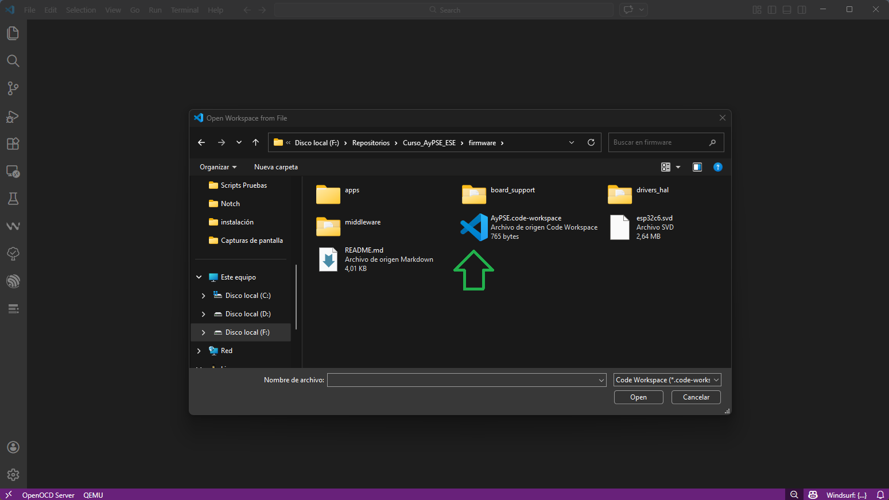
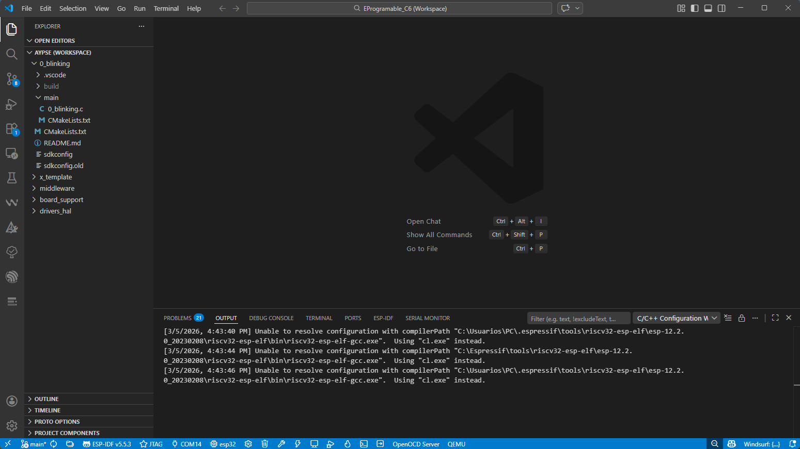
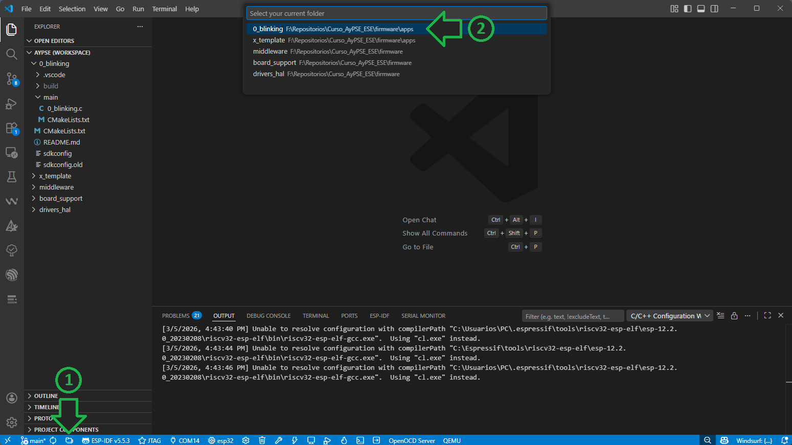
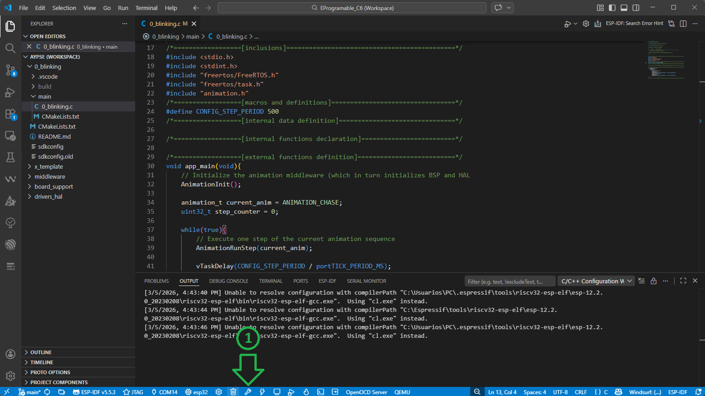
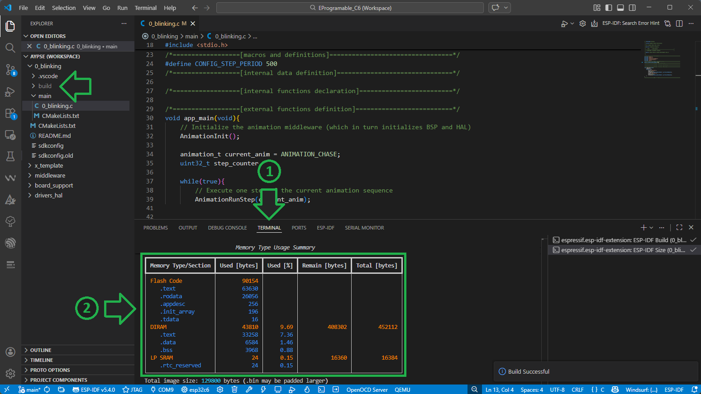

# Compilación

A continuación se detallan los pasos para la compilación del primer proyecto de ejemplo.

## Configuración del Espacio de Trabajo

1. En **Visual Studio Code** seleccionar el menú File -> Open Workspace from File...
    

2. Seleccione el archivo `AyPSE.code-workspace` ubicado en la carpeta `firmware` de su repositorio, por ejemplo: `C:/Repositorios/AyPSE_Penalva_2026/firmware/`.
    

3. Se le mostrará una ventana preguntando si confía en los autores de estos archivos. Seleccione la opción `Yes, I trust the authors`.

4. En la barra del Explorador (izquierda de la ventana) se le mostrará un árbol con la estructura de directorios del Espacio de Trabajo propuesta por la cátedra (ver más en [Estructura de Firmware](../firmware/README.md)). Allí encontrará:
    - 0_blinking: proyecto de ejemplo.
    - x_template: plantilla a partir de la cual crear nuevos proyectos.
    - middleware: capa de software intermedia con servicios lógicos independientes del hardware.
    - board_support: drivers para los periféricos y componentes externos conectados a la placa de desarrollo.
    - drivers_hal: capa de abstracción que simplifica e independiza el acceso a los periféricos internos del microcontrolador.

    

## Compilación ejemplo blinking

1. Comencemos compilando el primer ejemplo 0_blinking.
Como tenemos múltiples proyectos en el Espacio de Trabajo, debemos seleccionar siempre sobre cuál estamos trabajando.
Para eso presione el botón  (`ESP-IDF: Current Project`) y luego seleccione `0_blinking`.
    

2. Dentro de la carpeta 0_blinking (y en la de todos los proyectos) podrá encontrar:
    - .vscode: carpeta donde se guardan los archivos de configuración del proyecto.
    - main: carpeta dende se encuentra el código fuente del proyecto.
    - CMakelist.txt: archivo de configuración para la construcción del proyecto.
    - README.md: archivo con la descripción del proyecto.
    - sdkconfig: archivo de configuración del software del fabricante.

> [!NOTE]
> No se preocupe si el programa le muestra una advertencia en el valor de `"compileCommands"`, el mismo desaparecerá luego de la primera compilación.

3. El código fuente del programa lo puede encontrar en `0_blinking/main/0_blinking.c`

> [!NOTE]
> No se preocupe si el programa le muestra un error en el macro `portTICK_PERIOD_MS`, el mismo desaparecerá luego de la primera compilación.

4. Para compilar el proyecto, presione el botón  (`ESP-IDF: Build project`). Aparecerá una notificación de que el proyecto está siendo compilado.

    

> [!NOTE]
> La primera compilación de un proyecto puede tomar varios minutos.

5. Una vez finalizada la compilación, el programa le mostrará (en la pestaña `TERMINAL`) el porcentaje de memoria del microcontrolador que ocupará el proyecto.
Además se puede observar en la barra del Explorador que se ha creado una nueva carpeta `0_blinking/build/`, donde se almacenan todos los archivos resultado de la compilación.

    

---

Una vez finalizada la compilación del proyecto puede continuar con el instructivo de [Grabación y Depuración](./depuración.md).
