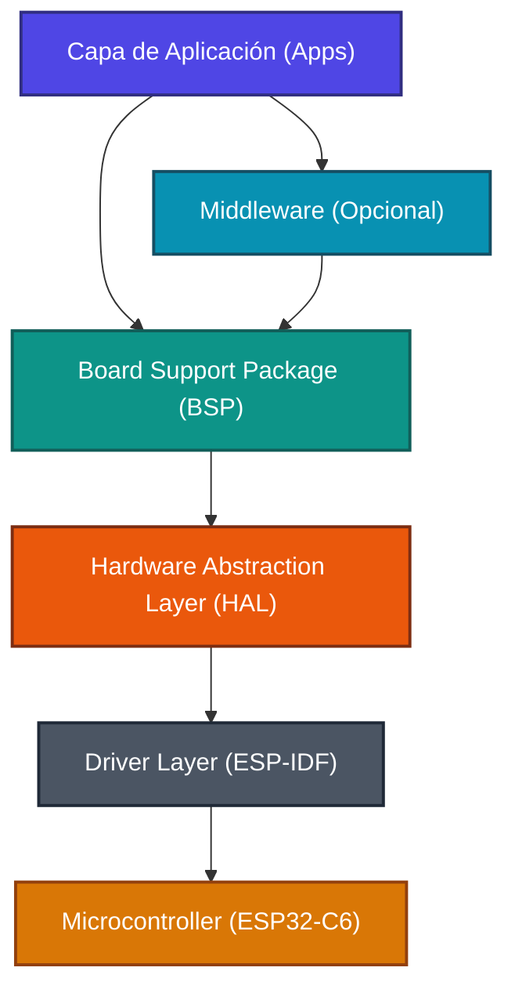

# Estructura de Firmware

Este repositorio está estructurado bajo una arquitectura de firmware en capas para facilitar el aprendizaje, el desarrollo modular y la portabilidad del código.

## Diagrama de la Arquitectura

A continuación se muestra el flujo de dependencias entre las capas del firmware:

---

## Capas del Firmware

### 1. Capa de Aplicación (Application Layer)
* **Directorio:** [apps/](./apps)
* **Descripción:** Es la capa más alta de la arquitectura. Contiene el software utilizado para propósitos específicos del sistema y de la aplicación, completamente desacoplado del hardware subyacente. El código aquí satisface las funcionalidades y requerimientos del producto o la práctica específica. No debe contener referencias directas a registros de hardware ni a drivers de bajo nivel (como llamadas directas a funciones del ESP-IDF).

### 2. Middleware
* **Directorio:** [middleware/](./middleware)
* **Descripción:** Capa intermedia que contiene software dependiente de los drivers de hardware subyacentes, pero que no contiene código de aplicación directo. Provee servicios genéricos como pilas de comunicación, sistemas de archivos, planificadores de tiempo real (RTOS) o implementaciones de protocolos. Su inclusión es opcional y debe justificarse según las necesidades de cada proyecto.

### 3. Paquete de Soporte de Placa (Board-Support Package / BSP)
* **Directorio:** [board_support/](./board_support)
* **Descripción:** Contiene los drivers de componentes externos conectados a la placa de desarrollo (por ejemplo: memorias EEPROM o flash externas, sensores, pantallas LCD/OLED, LEDs y pulsadores soldados en el PCB). Estos drivers dependen directamente de las funciones expuestas por la capa HAL.

### 4. Capa de Abstracción de Hardware (Hardware Abstraction Layer / HAL)
* **Directorio:** [drivers_hal/](./drivers_hal)
* **Descripción:** Reemplaza los accesos directos al hardware y registros del microcontrolador por llamadas a funciones con un mayor nivel de abstracción. Su propósito es independizar las capas superiores del chip específico en uso. Abstrae periféricos internos del microcontrolador como temporizadores, UART, SPI, I2C, GPIO y ADC.

### 5. Capa de Drivers (Driver Layer / ESP-IDF)
* **Descripción:** Software de bajo nivel específico del microcontrolador. Forma la base desde la cual el software de niveles superiores interactúa con y controla el microcontrolador. Para el ESP32, se corresponde directamente con la API provista por el **ESP-IDF**.

---

> [!IMPORTANT]
> **Reglas de Dependencia y Acoplamiento:**
> - El flujo de llamadas debe ser siempre **hacia abajo** (las capas superiores llaman a las inferiores).
> - Se debe evitar el **acoplamiento circular** o llamadas hacia arriba.
> - Ningún archivo de la capa de **Aplicación** debe incluir cabeceras de bajo nivel del ESP-IDF si existe una abstracción HAL o BSP correspondiente.
> - **Restricción por compilación (CMake):** Estas reglas de dependencia están configuradas de forma estricta mediante `PRIV_REQUIRES` en los archivos `CMakeLists.txt` de cada componente. Si intentas incluir una cabecera de una capa no permitida, como por ejemplo incluir `driver/gpio.h` (driver de ESP-IDF) desde la capa de Aplicación, el compilador arrojará un error de tipo `file not found`.
